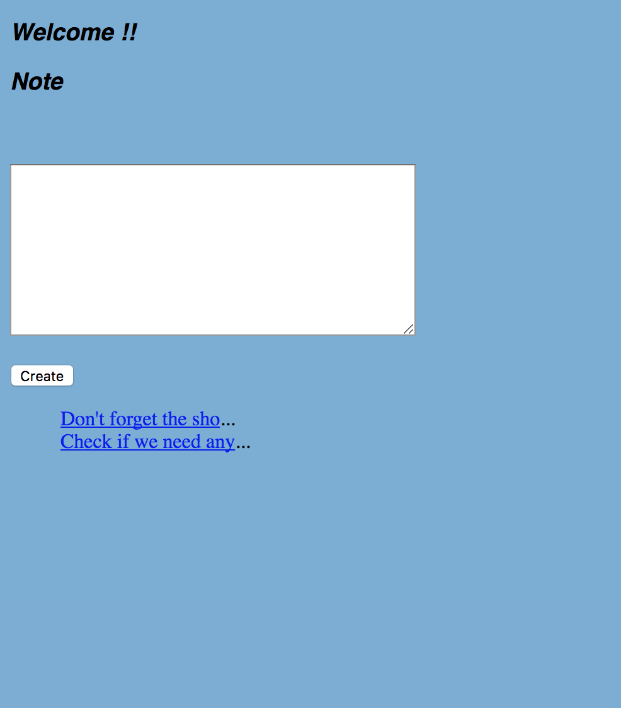
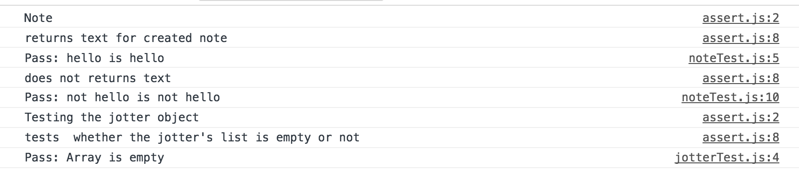

# Jotter

A single page note taking app built in JavaScript using no external libraries (apart from a simple server). This app uses event listeners written without JQuery and is tested with a test framework we wrote ourselves. Producing this from so little was daunting at first, so we started with the note model. Once we had some momentum from that the web app was built up quickly, one feature at a time.

## Getting Started

- Clone the repo
- Run ```npm init```
- Run ```npm start```
- Navigate to ```http://localhost:9292/note.html```
- Add a note!

## Using the App



To add a note, type whatever you want to remember into the text box and click create. You'll then see a truncated note added below. To view the full note, click the link.

## Testing

This app uses unit tests written in our own testing framework, found in the test folder.

To run the tests, open ```testRunner.html``` in a web browser and open up the browser console, the tests are shown thus:



## User Stories

```
As a programmer
I can see a list of my notes, where each note is abbreviated to the first 20 characters
So I can find the one I want
```

```
As a programmer
I can create a new note
So I can record something I need to remember
```

```
As a programmer
I can see the full text of an individual note on its own page
So I can see all the information in the note
```
